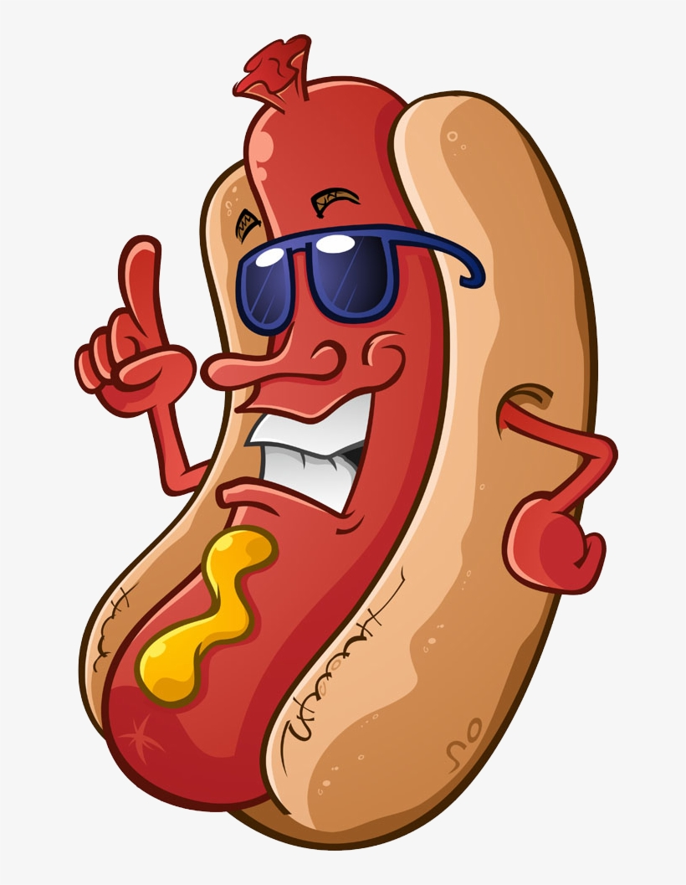

<a name="readme-top"></a>

<br/>

<br />
<div align="center">
  <a href="https://github.com/yourusername/">
    <!-- TODO: Add your own logo or banner if you want -->
    
  </a>
  <h3 align="center">Multiple Header/Footer Designs</h3>
</div>

<div align="center">
  Showcasing five unique header and footer styles in one HTML page.
</div>

<br />

<!-- TODO: Change the yourusername and your-repo-name accordingly -->


---

<br />
<br />

<details>
  <summary>Table of Contents</summary>
  <ol>
    <li>
      <a href="#overview">Overview</a>
      <ol>
        <li><a href="#key-components">Key Components</a></li>
        <li><a href="#technology">Technology</a></li>
      </ol>
    </li>
    <li><a href="#rules-practices-and-principles">Rules, Practices and Principles</a></li>
    <li><a href="#resources">Resources</a></li>
  </ol>
</details>

---

## 🧠 Overview

This project is a **single-page HTML/CSS website** that showcases five different header and footer designs. Each design has its own color scheme, font style (loaded from Google Fonts), and branding.  

It is meant for **web design practice**, teaching responsive styling, or serving as ready-made templates to be reused or customized.

### 🎯 Guiding Questions

- **What is this project about?**  
  A showcase of five distinct header/footer layouts in one page.

- **What is its purpose?**  
  To practice, demonstrate, and share creative website section designs.

- **What are its key components?**  
  Multiple themed header/footer sections stacked vertically with unique styles.

- **What technologies are used?**  
  HTML and CSS (with embedded styling and Google Fonts integration).

### 🧩 Key Components

- 5 fully designed header/footer pairs:
  - HotdogForSale (Design 1 – Rin)
  - Shidou (Design 2)
  - Sae (Design 3)
  - Barou (Design 4)
  - Rin (Design 5)
- Unique color schemes and gradients
- Google Fonts integration for typography
- Flexbox layout for headers/footers
- Logo/image support

### 💻 Technology


---

## 📏 Rules, Practices and Principles

1. Keep your HTML file named `index.html`.
2. Organize all images inside an `assets/img` folder.
3. Use clear and consistent section classes for designs.
4. Maintain readable, well-indented CSS (even when embedded).
5. Keep fonts linked via Google Fonts CDN.
6. Use semantic HTML (headers, nav, footer tags).
7. Recommended folder structure:

```plaintext
ProjectFolder/
│
├── assets/
│   └── img/
│       ├── hotdog.png
│       ├── shido.jpg
│       ├── sae.jpg
│       ├── baru.jpg
│       └── rin.jpg
└── index.html
| Title         | Purpose                             | Link                                                                                              |
| ------------- | ----------------------------------- | ------------------------------------------------------------------------------------------------- |
| Google Fonts  | Sourcing unique fonts               | [https://fonts.google.com](https://fonts.google.com)                                              |
| Google Images | Finding placeholder logos or photos | [https://images.google.com](https://images.google.com)                                            |
| W3Schools     | CSS Flexbox Reference               | [https://www.w3schools.com/css/css3\_flexbox.asp](https://www.w3schools.com/css/css3_flexbox.asp) |
| MDN Web Docs  | HTML/CSS Best Practices             | [https://developer.mozilla.org](https://developer.mozilla.org)                                    |
